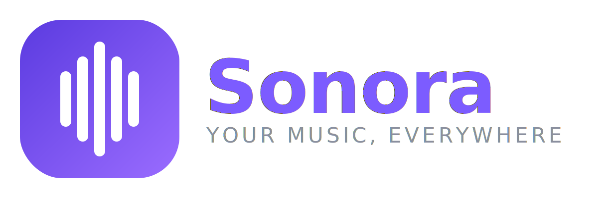

<p align="center">
  
</p>

# Sonora

A clean, native Android music player for your own **Subsonic / Navidrome** server. Your music lives on your server; Sonora streams it to your phone from anywhere.

Built with Kotlin, Jetpack Compose (Material 3) and Media3/ExoPlayer.

## Features

- **Connect to any Subsonic-compatible server** (Navidrome, Airsonic, Gonic, …) with URL + username + password (token auth, password never sent in the clear).
- **Bottom-nav app** — Home, Library, Search, Playlists.
- **Home** browse rails: Recently added, Recently played, Most played, Discover.
- **Library** tabs: Albums grid, Artists, Favourites.
- **Super-easy search** across artists, albums and songs, with instant results.
- **Artist pages** and **album pages** with play / shuffle.
- **Playlists** — browse and play your server playlists.
- **Favourites** — heart any song or album (synced to the server via star/unstar).
- **Play queue** — see what's up next and jump to any track.
- **Full player** — shuffle, repeat (off/all/one), seek, favourite, sleep timer.
- **Background playback** with lock-screen / notification controls and a proper media session (headset buttons, "audio becoming noisy" pause, audio focus).
- **Smart caching** — streamed audio is cached (up to 1 GB), so replays are instant and recently played music survives a flaky connection.
- **In-app updates** — Sonora checks GitHub on launch and offers a one-tap update when a new release is out (no Play Store needed). All release builds share one signing key so updates install cleanly.

## Publishing to Google Play

See **[PLAY_PUBLISHING.md](PLAY_PUBLISHING.md)** — the project already builds a signed
`.aab` via the `Play Release (AAB)` workflow; you just add a signing key and store listing.

## Install

Grab the latest APK from the [Releases](../../releases) page (or the **Build APK** workflow artifacts) and install it on your phone. You may need to allow "install from unknown sources".

Every push to `main` builds a debug APK as a CI artifact; tagging a commit `vX.Y.Z` publishes a Release with the APK attached.

## Usage

1. Open the app, enter your server URL (e.g. `http://192.168.x.x:4533` or a Tailscale/VPN address), username and password.
2. Tap **Connect**. Your albums load.
3. Tap an album → **Play**, or search and tap a song.
4. Playback continues in the background; control it from the notification or lock screen.

> Tip: if your server is only reachable over a VPN like Tailscale, make sure the VPN is connected on the phone and use the server's VPN address.

## Build locally

Requires JDK 17 and the Android SDK.

```bash
./gradlew assembleDebug
# APK at app/build/outputs/apk/debug/app-debug.apk
```

## Tech

| Concern | Choice |
|---------|--------|
| Language / UI | Kotlin + Jetpack Compose (Material 3) |
| Playback | AndroidX Media3 (ExoPlayer + MediaSessionService) |
| Networking | Retrofit + OkHttp + Gson |
| Images | Coil |
| Min / Target SDK | 26 / 34 |

## Roadmap ideas

- Offline downloads / caching
- Playlists and favourites
- Artist view and "recently added" / "random" rows
- Android Auto
- Encrypted credential storage

## License

MIT
